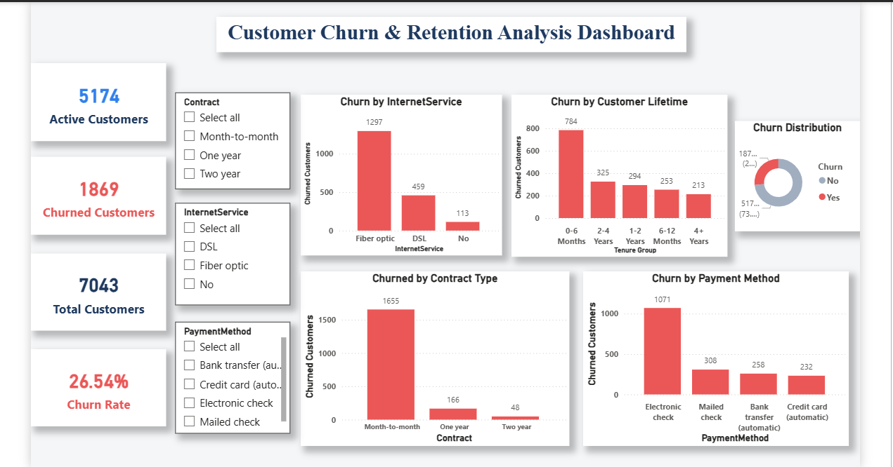

# Customer Churn & Retention Analysis – Task 02

## Project Overview

This project is part of the Future Interns Data Science & Analytics track (DS).

The objective of this task is to analyze customer subscription data to understand churn behavior and identify key factors affecting customer retention. The dashboard helps businesses identify why customers leave and what actions can reduce churn.

The analysis was performed using the Telco Customer Churn dataset and visualized using Power BI.

---

## Tools Used

* Power BI
* Microsoft Excel / CSV Dataset
* GitHub for project documentation

---

## Dataset

* Telco Customer Churn Dataset
* Contains information on:

  * Customer demographics
  * Contract type
  * Internet service
  * Payment method
  * Monthly and total charges
  * Customer tenure
  * Churn status (Yes/No)

Total Records: 7,043 customers

---

## Dashboard Features

The dashboard provides insights into:

* Total Customers
* Active Customers
* Churned Customers
* Overall Churn Rate
* Churn by Contract Type
* Churn by Internet Service
* Churn by Customer Tenure (Lifetime)
* Churn by Payment Method
* Churn Distribution (Yes vs No)
* Interactive filters for:

  * Contract Type
  * Internet Service
  * Payment Method

---

## Dashboard Preview

### Overview

### Filtered View Example

---

## Key Business Insights

1. **Month-to-month customers show the highest churn**, indicating low long-term commitment.
2. **Customers in their first 6 months have the highest churn rate**, highlighting early-stage risk.
3. **Fiber optic users have higher churn**, suggesting possible pricing or service quality concerns.
4. Customers using **electronic check payment method churn more frequently** than those using automatic payment options.
5. Long-term contract customers (one-year and two-year) demonstrate significantly **lower churn**, indicating higher loyalty.

---

## Business Recommendations

* Encourage customers to switch to **long-term contracts** through discounts or loyalty benefits.
* Improve **customer onboarding and engagement** during the first 6 months.
* Promote **automatic payment methods** to improve retention.
* Investigate and improve **fiber optic service experience or pricing**.
* Identify high-risk customers early and run **targeted retention campaigns**.

---

## Files Included

* `Customer_Churn_Analysis.pbix` – Power BI dashboard file
* `telco_churn.csv` – Dataset used
* `dashboard_overview.png` – Full dashboard screenshot
* `dashboard_filtered.png` – Example filtered view

---

## Author

**Anushka Baidya**
B.Tech CSE | Data Science & Analytics Intern
